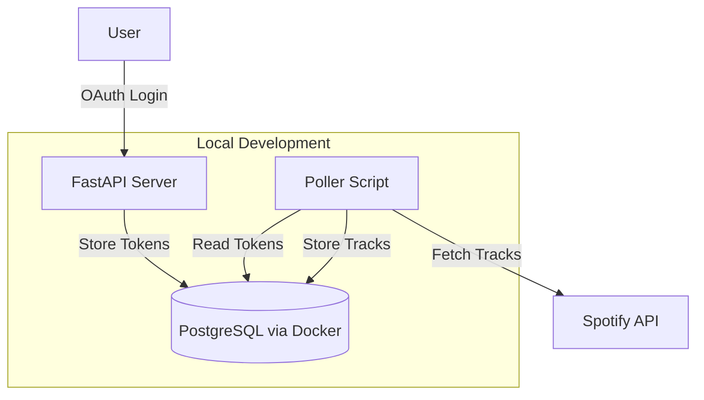
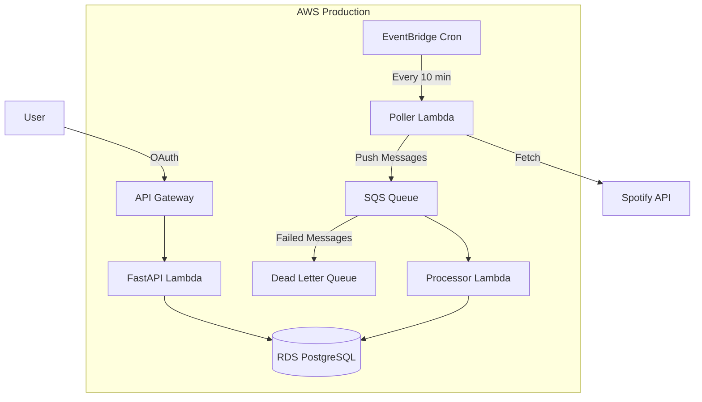

# Spotify Event Pipeline - Project Approach

## Overview

Build a hybrid system: FastAPI handles OAuth and API endpoints, while background polling runs as a separate service (locally as a script, in prod as Lambda). Start local, then deploy to AWS.

---

## Architecture

### Local Development



### Production (AWS)



---

## Phase 1: Local Development (Weeks 1-4)

### Week 1: Database + OAuth

1. **Set up PostgreSQL with Docker**

   - Create `docker-compose.yml` with Postgres
   - Define schema: `users`, `spotify_tokens`, `listening_events`

2. **Complete OAuth flow in FastAPI**

   - Finish `/callback` endpoint in [`src/poller/main.py`](src/poller/main.py)
   - Exchange auth code for tokens
   - Store refresh token in database
   - Complete [`src/poller/auth.py`](src/poller/auth.py) - token refresh logic

3. **Define data models**

   - Use SQLAlchemy in [`src/common/models.py`](src/common/models.py)
   - `SpotifyToken` - stores user tokens
   - `ListeningEvent` - stores track plays with composite primary key `(user_id, track_id, played_at)`

### Week 2: Poller Service

1. **Create poller as standalone script**

   - New file: `src/poller/poll.py`
   - Fetch recently-played from Spotify API
   - Track `last_polled_at` timestamp to avoid re-fetching
   - Handle rate limits (429 responses)

2. **Local queue simulation**

   - For local dev: write directly to DB (skip queue)
   - Use an abstraction so you can swap in SQS later

### Week 3: Processing + Idempotency

1. **Implement idempotent writes**

   - Use `ON CONFLICT DO NOTHING` or check before insert
   - Primary key `(user_id, track_id, played_at)` prevents duplicates

2. **Test the full local flow**

   - Login via FastAPI
   - Run poller script manually
   - Verify data in Postgres

### Week 4: Polish Local Dev

1. **Add basic error handling**

   - Token expiry/refresh
   - Spotify API errors
   - Database connection errors

2. **Create a simple API endpoint** to view your listening history

   - `GET /history` returns recent tracks from DB

---

## Phase 2: AWS Deployment (Weeks 5-8)

### Week 5: Infrastructure Setup

1. **Set up AWS CDK**

   - Create `infra/` directory
   - Bootstrap CDK in your AWS account

2. **Deploy basic resources**

   - SQS queue + DLQ
   - RDS PostgreSQL (smallest instance)
   - Secrets Manager for Spotify credentials

### Week 6: Lambda Functions

1. **Wrap FastAPI with Mangum** for Lambda
2. **Create Poller Lambda** - same logic, triggered by EventBridge
3. **Create Processor Lambda** - reads from SQS, writes to RDS

### Week 7: Wiring + Testing

1. **Connect EventBridge to Poller Lambda**
2. **Connect SQS to Processor Lambda**
3. **Test end-to-end on AWS**

### Week 8: Hardening

1. **Add DLQ handling**
2. **Set up CloudWatch alarms**
3. **Set AWS Budget alerts at $20**

---

## Recommended Project Structure

```
spotify-event-pipeline/
├── src/
│   ├── common/
│   │   ├── models.py         # SQLAlchemy models
│   │   ├── database.py       # DB connection
│   │   └── config.py         # Environment config
│   ├── api/
│   │   ├── main.py           # FastAPI app (OAuth + API)
│   │   └── handler.py        # Mangum wrapper for Lambda
│   └── poller/
│       ├── poll.py           # Polling logic
│       ├── spotify.py        # Spotify API client
│       └── handler.py        # Lambda handler
├── infra/                    # CDK (add in Phase 2)
├── docker-compose.yml        # Local Postgres
├── requirements.txt
└── README.md
```

---

## Key Decisions Locked In

| Component | Local | Production |

|-----------|-------|------------|

| API | FastAPI + uvicorn | Lambda + API Gateway |

| Poller | Python script (manual/cron) | Lambda + EventBridge |

| Queue | Skip (direct DB write) | SQS |

| Database | Docker Postgres | RDS |

| Secrets | `.env` file | Secrets Manager |

---

## Immediate Next Step

Start with **Week 1, Task 1**: Create `docker-compose.yml` and define your database schema. Everything else depends on having the database ready.
