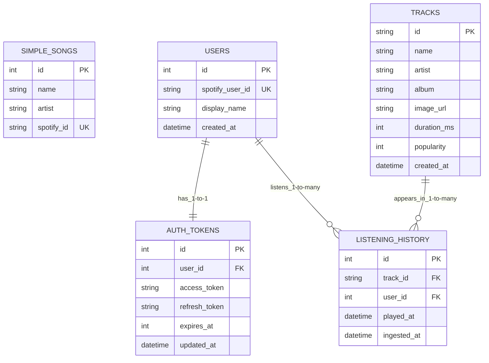

```mermaid
erDiagram
    SIMPLE_SONGS {
        int id PK
        string name
        string artist
        string spotify_id UK
    }

    USERS {
        int id PK
        string spotify_user_id UK
        string display_name
        datetime created_at
    }

    AUTH_TOKENS {
        int id PK
        int user_id FK
        string access_token
        string refresh_token
        int expires_at
        datetime updated_at
    }

    TRACKS {
        string id PK
        string name
        string artist
        string album
        string image_url
        int duration_ms
        int popularity
        datetime created_at
    }

    LISTENING_HISTORY {
        int id PK
        string track_id FK
        int user_id FK
        datetime played_at
        datetime ingested_at
    }

    USERS ||--|| AUTH_TOKENS : has_1-to-1
    USERS ||--o{ LISTENING_HISTORY : listens_1-to-many
    TRACKS ||--o{ LISTENING_HISTORY : appears_in_1-to-many
```

